# My Learning Kafka

  

    <b>Theory</b>
  

* 

  

  <b>What is Kafka?</b>
  

   
  
Apache Kafka là một nền tảng mã nguồn mở dùng để <b>xử lý</b> và 
  <b>truyền tải dữ liệu sự kiện theo thời gian thực</b> trên nhiều máy chủ
  (open-source distributed <b>event streaming</b> platform).

  > Mỗi transaction giao dịch sẽ tạo ra một <b> event </b> rồi gửi đến Kafka server.
  > + Trên ứng dụng thực tế, các transaction giao dịch có thể diễn ra đồng thời với 1 ố lượng rất
      lớn trong vài giây, việc này tạo ra một loạt các event gửi đến Kafka, quá trình này gọi
      là <b> Create / Generate </b> realtime event stream of data. Khi Kafka server nhận được data,
      nó cần phải xử lí.
  > + Giả sử ứng dụng có một <i> client application </i> có vai trò là đọc data từ Kafka và xử lí
  yêu cầu đặt vé máy bay và client application muốn hạn chế mỗi user chỉ được phép thực hiện 10
  transaction mỗi ngày. Nếu vượt mức transaction, application sẽ <b> send một mail thông
  báo </b> đến email của user.
    >+ Trong trường hợp như trên, client application phải liên tục thực hiện <b> validation </b>
kiểm tra số lượng transaction của mỗi user. Nghĩa là application phải <b> liên tục </b>
 lắng nghe Kafka Server để nhận message. Quá trình này được gọi là <b> Processing realtime event
stream of data </b>.

    <li>
    Khi nói về <b> distributed </b>, thì trong Microservices, định nghĩa distributed nghĩa là phân tán nhiều máy chủ đến nhiều node khác nhau hay nhiều region khác nhau để cân bằng tải và tránh down time:
      <ul>
        <li>
          Kafka là distributed platform, nghĩa là ta cũng có thể phân tán Kafka server chạy ở nhiều region khác nhau.
        </li>
        <li>
          Trong trường hợp có một server nào đó bị sập, server khác sẽ thay thế nhận lấy traffic để tránh trường hợp cả hệ thống bị sập.
        </li>
      </ul>
    </li>

* 

  

  <b>Why do we need Kafka?</b>
  

  <b>Ví dụ 1: </b>

  <ul>
    <li>Services A có 1 message quan trọng cần phải nhận vì message này liên quan đến logic của toàn bộ hệ thống hay
  liên quan đến 1 giao dịch. Thế nhưng trong lúc gửi thì server A đang bị sập và không thể nhận được => mất mát  liệu
  trong hệ thống (tệ nhất là sai logic của toàn bộ hệ thống). </li>
  <li>
  Trong trường hợp này, Kafka đóng vai trò như là một hòm đưa thư, khi message đến service, message sẽ được 
  đặt vào hòm thư này và khi hệ thống hoạt động trở lại, chỉ việc lấy tất cả message từ hòm thư và xử lí đồng loạt.</li>
  </ul>

  <b>Ví dụ 2: </b>

  
Giả sử chúng ta có 4 service cần giao tiếp và kết nối với 5 service/server khác nhau

  
  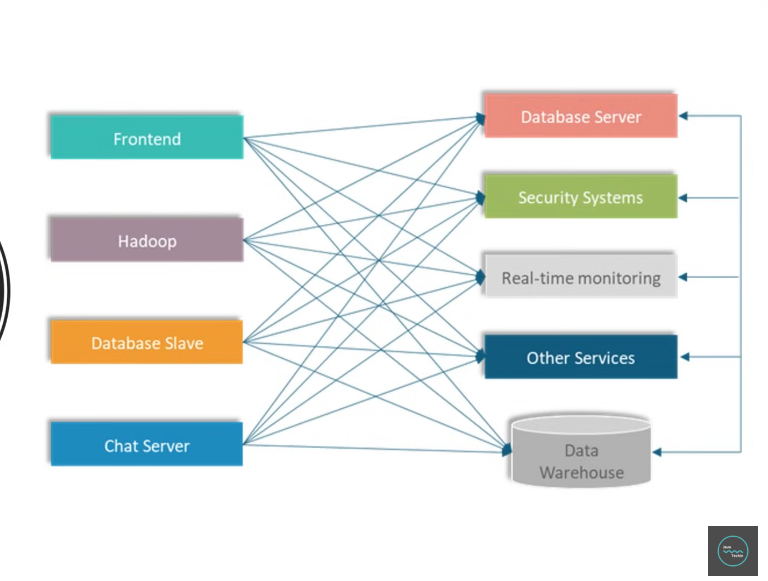

  Trong trường hợp này, việc quản lí kết nối giữa các service sẽ là một bài toán khó khăn 
  bởi vì chúng ta cần phải quan tâm đến các yếu tố sau đây đối với mỗi service:
    - Data Format
    - Connection Type
    - Số lượng Connection
  
  1. Data Format:
     - Mỗi service có thể muốn cung cấp hoặc nhận một loại data theo format khác nhau. Rất khó khăn để handle data format và schema cho mỗi service trong trường hợp này.
  2. Connection Type:
     - Có thể có nhiều loại kết nối (HTTP, TCP, JDBC, ...), với nhiều loại connect này sẽ rất khó để maintain giữa các service.
  3. Số lượng Connection: 
     - Nếu chúng ta nhìn nhận kĩ càng sẽ dễ dàng nhận thấy mỗi service ở sơ đồ trên hiện tại đang duy trì 5 connection đến các server đích. Tổng cộng là 20 connection.

  Với nhiều kết nối và phân tán ra như vậy, việc quản lý rất khó khăn. Kafka sẽ giải quyết vấn đề bằng cách tập trung chúng lại một chỗ như sau:

  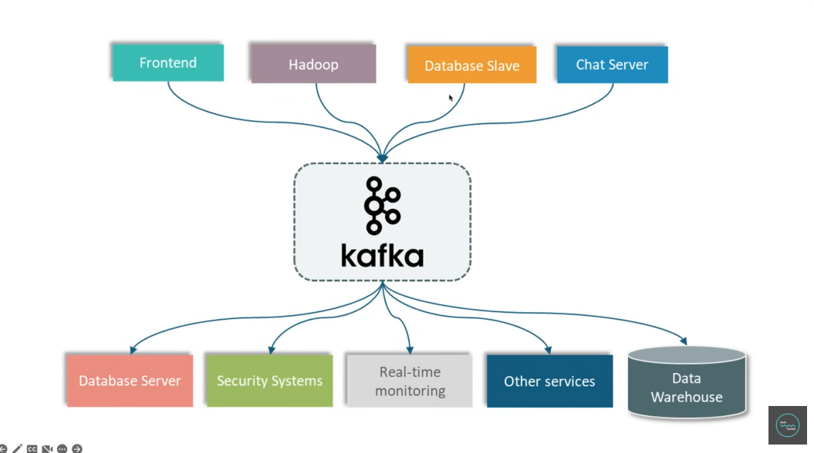

  Xem xét sơ đồ:
    + Mỗi service giờ đây sẽ không quan tâm đến data format, chúng chỉ đơn giản là gửi dữ liệu tập trung đến Kafka server.
    + Server đích cần loại data nào, sẽ chủ động lấy từ Kafka ra.
    + Số lượng connection giảm đi, giờ đây chỉ còn 9 connection.

* 

  

  <b>How does Kafka work?</b>
  

  <b>Khái quát đơn gản về mô hình Pub/Sub: </b>
  
  
<b> Bao gồm 3 phần:</b> Publisher, Subsciber, Message Broker

      <ul>
        <li>
          Publisher là bên sẽ "phát hành" event hoặc message đến hệ thống Kafka.
        </li>
        <li>
          Message sẽ đc gửi đi rồi lưu trữ tại Message Broker hay nói cách khác là Kafka Server.
        </li>
        <li>
          Subsribers sẽ đi đến các Message Broker cụ thể và yêu cầu Message, hoặc các Subsribers cơ bản sẽ lắng nghe các broker để lấy message.
        </li>
      </ul>

  <b>Ví dụ 2: </b>

  
Giả sử chúng ta có 4 service cần giao tiếp và kết nối với 5 service/server khác nhau

  

  Trong trường hợp này, việc quản lí kết nối giữa các service sẽ là một bài toán khó khăn
  bởi vì chúng ta cần phải quan tâm đến các yếu tố sau đây đối với mỗi service:
  - Data Format
  - Connection Type
  - Số lượng Connection

  1. Data Format:
    - Mỗi service có thể muốn cung cấp hoặc nhận một loại data theo format khác nhau. Rất khó khăn để handle data format và schema cho mỗi service trong trường hợp này.
  2. Connection Type:
    - Có thể có nhiều loại kết nối (HTTP, TCP, JDBC, ...), với nhiều loại connect này sẽ rất khó để maintain giữa các service.
  3. Số lượng Connection:
    - Nếu chúng ta nhìn nhận kĩ càng sẽ dễ dàng nhận thấy mỗi service ở sơ đồ trên hiện tại đang duy trì 5 connection đến các server đích. Tổng cộng là 20 connection.

  Với nhiều kết nối và phân tán ra như vậy, việc quản lý rất khó khăn. Kafka sẽ giải quyết vấn đề bằng cách tập trung chúng lại một chỗ như sau:

  

  Xem xét sơ đồ:
  + Mỗi service giờ đây sẽ không quan tâm đến data format, chúng chỉ đơn giản là gửi dữ liệu tập trung đến Kafka server.
  + Server đích cần loại data nào, sẽ chủ động lấy từ Kafka ra.
  + Số lượng connection giảm đi, giờ đây chỉ còn 9 connection.

 

 

  

    <b>Kafka Architecture & Components</b>
  

* 

  

  <b>Cluster</b>
  

  
Cluster là một khái niệm quen thuộc trong thế giới Microservice, chúng là một cụm các máy chủ. Trong định nghĩa của Kafka 
  tương tự. Bởi vì Kafka cũng là hệ thống phân tán, nó có thể có nhiều Kafka server hay Broker trong một Kafka Cluster. 

    <ul>
      <li>
        Có thể có một hoặc nhiều broker trong một Kafka cluster.
      </li>
      <li>
        Cluster giúp đảm bảo khả năng chịu lỗi, khả năng mở rộng và hiệu suất cao trong việc xử lý một lượng lớn dữ liệu event.
      </li>
    </ul>
  
  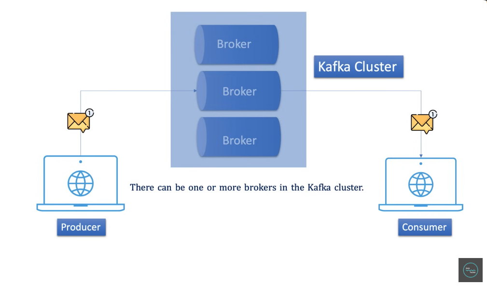
* 

  

  <b>Topic</b>
  

  
 Topic định nghĩa danh mục cho các message hoặc dán nhãn cho các message và từ đó, Consumer có thể nhận 
  được các message liên quan đến Topic mà mình đã đăng ký lắng nghe. 

  
 Xem xét lại ví dụ PayTM trước đó: 

  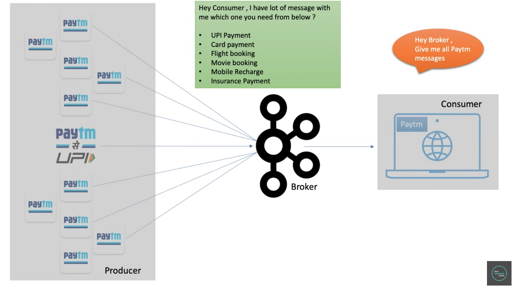
  
  <ul>
    <li><b>Consumer</b> - client application yêu cầu Kafka gửi tất cả message (các transaction) cho mình.</li>
    <li><b>Broker</b> - Kafka gửi toàn bộ message bên trong đến cho application, dẫn đến có nhiều message không liên quan.</li>
  </ul>

  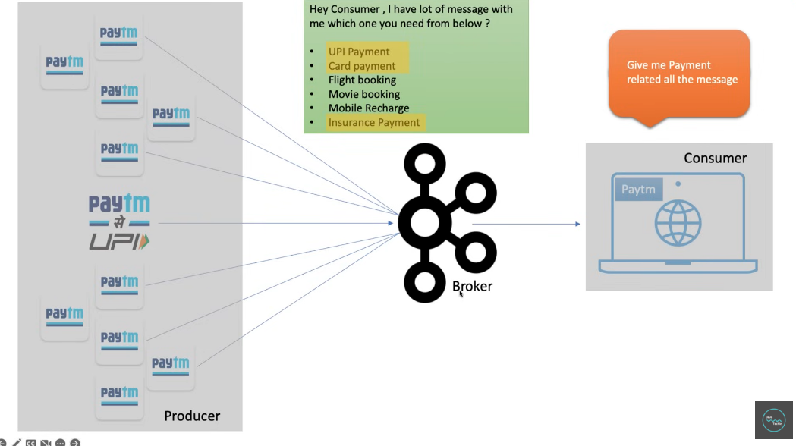

  <ul>
    <li><b>Consumer</b> - client application thay vào đó, yêu cầu gửi tất cả message payment liên quan cho mình.</li>
    <li><b>Broker</b> - Kafka lại tiếp tục confuse vì có nhiều loại message bên trong nó, và không biết làm sao để lọc ra các message liên quan đến payment.</li>
  </ul>
  => lúc này chúng ta cần đến Topic.

  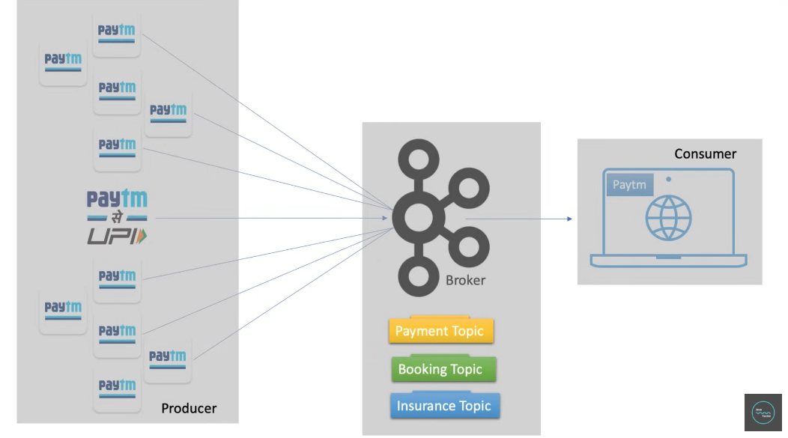

  <ul>
    <li>Với Topic, Broker có thể phân nhóm các message theo từng Topic khác nhau, và Consumer giờ đây chỉ cần lắng nghe một Topic cụ thể để nhận message liên quan</li>
    <li>Chúng ta có thể xem Topic giống như là các bảng trong database của Kafka Server, với mỗi message, Kafka sẽ kiểm tra xem nên thêm message đó vào bảng nào trong database.</li>
  </ul>
  
  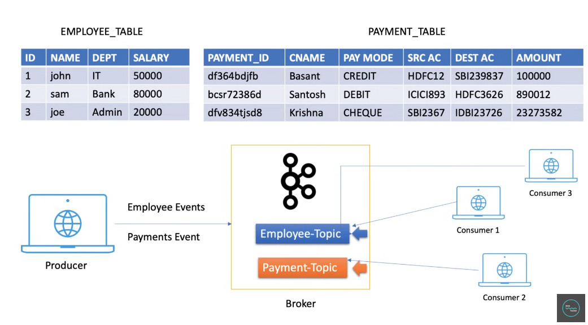

* 

    

    <b>Partitions</b>
    

  
    
Chúng ta đã biết PayTM sẽ sản sinh ra rất nhiều message đến Broker và Broker có thể lưu các message nào theo từng Topic.

    Giả sử lúc này đây, chúng ta có số lượng cực lớn các message, lên đến hàng triệu. Lúc này đây topic là không đủ để handle các message.

    Việc lưu các message trở nên bất khả thi trên một máy chủ. Do kafka là một hệ thốntg máy chủ phân tán, thế nên chúng ta có thể chia nhỏ các Topic thành nhiều phần, và phân tán mỗi phần sang một máy chủ khác.

    Các phần topic được gọi là các Partitions

  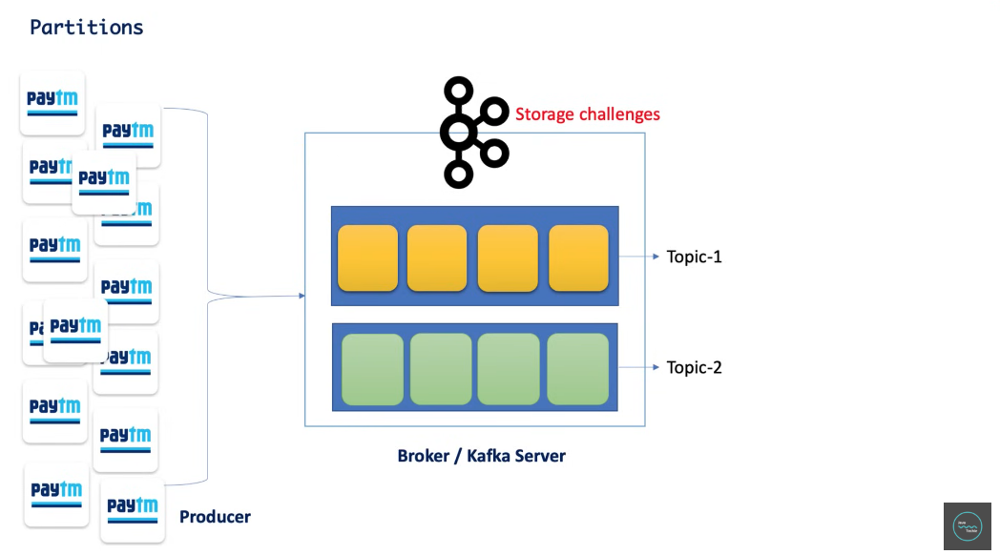
  
  
Với việc có nhiều Partiton cho mỗi Topic, mỗi khi publisher gửi một lượng lớn message cho một topic nhất định, thì mỗi Partition trong topic chỉ việc lưu một phần message, giúp cải thiện đáng kể hiệu năng.

  Và kể cả khi có một partition bị down, miễn là các partition khác còn hoạt động thì cả kênh giao tiếp sẽ không bị gián đoạn.
  

* 

    

    <b>Offset</b>
    

    
Đến giờ chúng ta đã nắm được:

    <ul>
      <li>Mỗi kafka cluster sẽ có nhiều kafka server.</li>
      <li>Mỗi kafka server sẽ có nhiều kafka topic.</li>
      <li>Mỗi Kafka topic sẽ có nhiều partions.</li>
    </ul>
    
Mỗi khi producer gửi message đến, message này sẽ nằm bên trong bất kì partition nào của một topic nhất định.

    
Chúng ta sẽ không kiểm soát quá trình này, quá trình này hoạt động dựa trên quy tắc xoay vòng. Mỗi khi một message được đặt vào một partion, nó sẽ được gắn một số để định danh vị trí được gọi là offset. Các số này là một dãy liên tục tăng.

    
Vai trò của offset là sẽ giúp chúng ta biết được message nào đã được consume bởi consumer.

    
  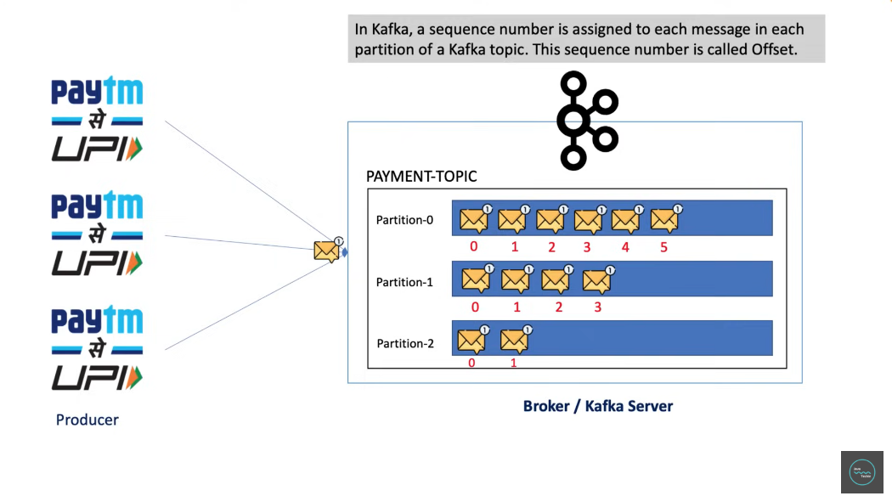

  
Lấy ví dụ:

   <ul>
      <li>Giả sử trong quá trình hoạt động, Consumer đã consume được đến message có offset 3 thì bỗng dưng Consumer vì lí do gì đó lại offline.</li>
      <li>Trong quá trình offline, có thêm 2 message offset 4 và 5 được gửi đến.</li>
      <li> 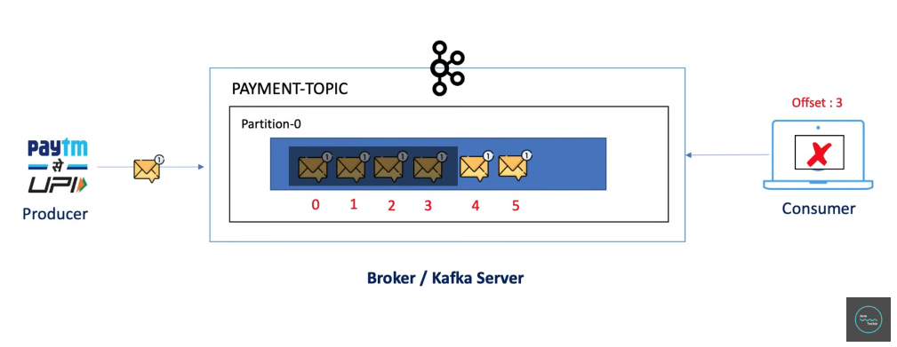</li>
      <li>Khi consumer online trở lại, số offset 3 sẽ giúp Broker biết được nên gửi tiếp message offset 4 và 5 cho consumer.</li>
      <li> 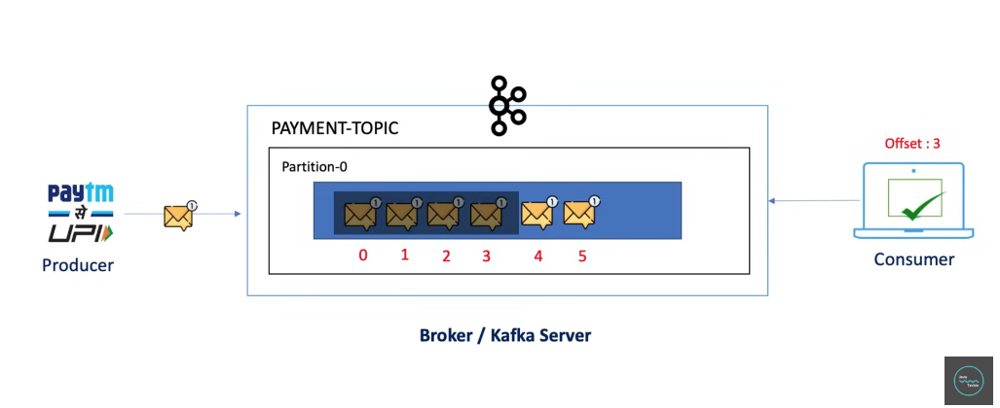</li>
   </ul>
* 

    

    <b>Consumer Groups</b>
    

    
Đến giờ chúng ta đã nắm được:

    <ul>
      <li>Producer sẽ push một lượng lớn các message vào một Topic.</li>
      <li>Các Message lại được chia nhỏ vào nhiều Partition khác nhau của một Topic.</li>
      <li>Bên trong mỗi Partiton, các message sẽ có được đánh dấu một số Offset.</li>
    </ul>
    
Với kiến trúc hiện tại, mỗi một consumer phải lắng nghe tất cả partition để đảm bảo lấy được message cần thiết. Điều này là không tối ưu vì không có tính tuần tự.

  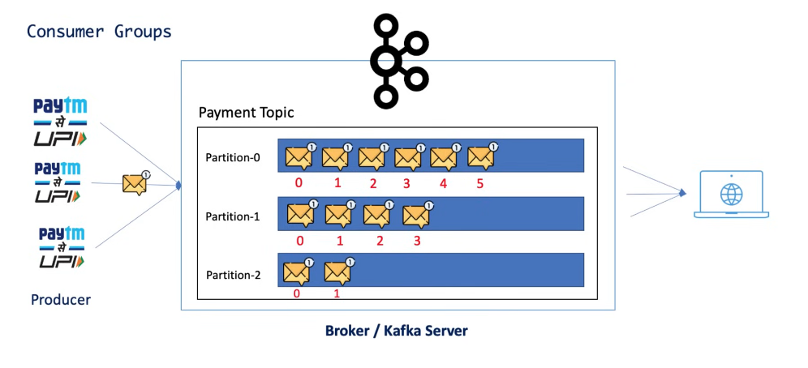

  
Giải quyết vấn đề này, chúng ta sẽ chia nhỏ workload, cụ thể là:

   <ul>
      <li>Xác định n instance consumer.</li>
      <li>Nhóm toàn bộ consumer này vào một đơn vị khác có tên payment_consumer_group.</li>
      <li>Với nhiều consumer, chúng ta có thể chia workload cho mỗi consumer để có được hiệu suất throughput tốt hơn.</li>
      <li> 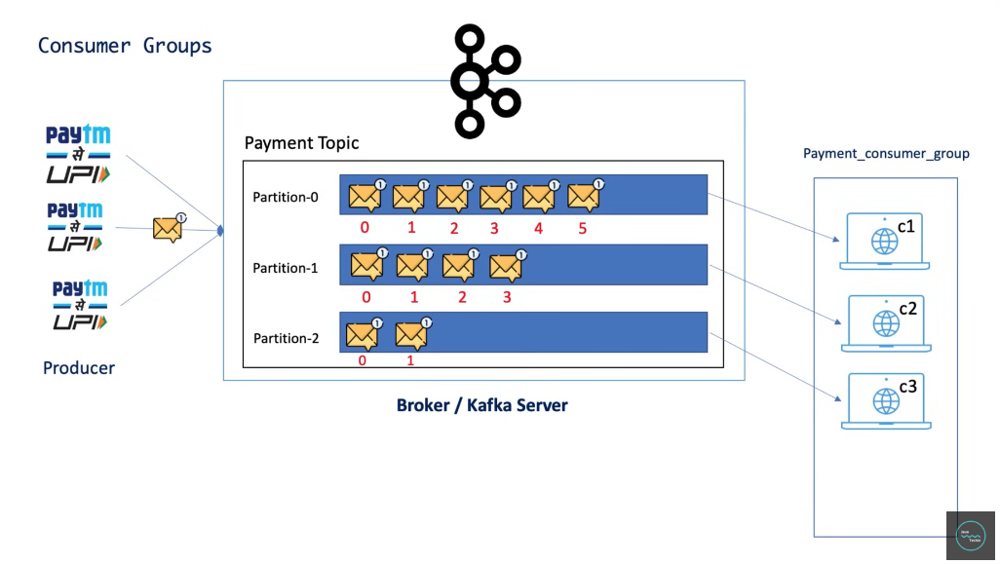</li>
          <i> => Với cách tiếp cận này, cả 3 consumer sẽ chỉ cần lắng nghe một partition. </i>
   </ul>
  
<b>Lưu ý:</b> <i>Chúng ta không thể đảm bảo thứ tự của consumer và partion, bất kì consumer nào cũng có thể lắng nghe đến bất kì partiton nào. Việc này sẽ được quyết định bởi Coordinator</i>

  
Chúng ta đã có 3 consumer lắng nghe đến 3 partion khác nhau, vậy trong trường hợp có consumer thứ 4?

    
  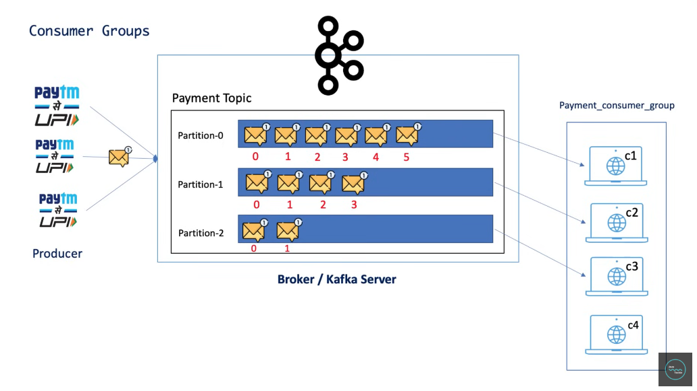
  
 <b>Không thay đổi!</b> Consumer thứ 4 sẽ idle bởi vì tất cả các partion đều đã được lắng nghe và không còn partiton nào cho Consumer này. 
  Nhưng trong trường hợp có bất kì Consumer nào reject hoặc offline, thì Consumer thứ 4 sẽ có cơ hội connect.

  
Khái niệm này được gọi là Consumer Rebalancing.

 

 

 

 

 

  

    <b>Event-Driven Architecture </b>
  

* 

  

  <b>What is event-driven architecture?</b>
  

  - Event-driven architecture (EDA) là một `software design pattern`
  - Ý tưởng của `EDA` là các ứng dụng khác nhau có thể bất `đồng bộ tương tác được với nhau` 
    > + 1 ứng dụng có thể `produce` (tạo ra) các `events/message` gửi lên platform trung gian gọi là 
    `event broker/mesage broker` sau đó có nhiều ứng dụng khác `consume` (tiêu thụ) các event/message này
    gọi là `consumer`.
    > + Các ứng dụng này có thể gửi và nhận các `event/message` được với nhau một cách <b> bất đồng bộ </b>.

    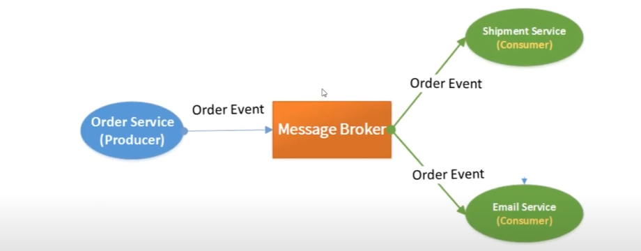
  
    > VD: `Chúng ta có 1 ứng dụng là order services`
    > + Giả dụ chúng ta có order services, khi chúng ta tạo đơn hàng sẽ tạo ra 1 order `event/message`
    gửi lên `Message broker` (1 ứng dụng trung gian) theo kiến trúc event driven thì `Message broker` sẽ lưu lại các
    `message/event` này.
    > + Tùy vào thiết kế của từng server thì `Message broker` sẽ gửi cho các `Consumer`.
    > + Ở đây 2 `Consumer`: Shipment service, Email service sẽ nhận `event/message` từ `Message broker` và tiếp nhận 
    nhiệm vụ của riêng nó.
  
  - Trong kiến trúc `Event-driven` này thì các ứng dụng có thể được viết bằng <b> bất cứ ngôn ngữ nào </b>.
  - Kiến trúc `Event-driven` được tương tác với nhau 1 cách <b> bất đồng bộ </b>. 

 

 

